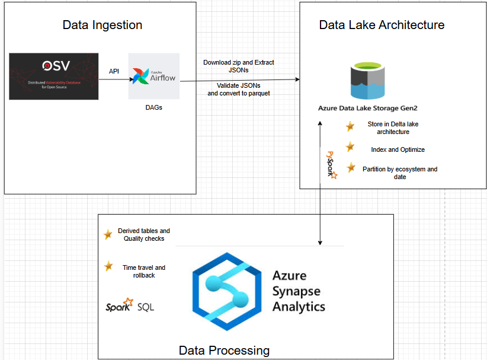

# **OSV Vulnarbilities Data Engineering Project**

This project implements a cloud-based **Data Lake Architecture** for storing and analyzing **Open Source Vulnerabilities (OSV) data**. The system enables efficient querying and analysis of vulnerability data across different package ecosystems, leveraging **Apache Airflow, Delta Lake, Apache Spark, and Azure Synapse Analytics**.

---

## **📌 Architecture Overview**
The architecture consists of **three main components**:

### **1️⃣ Data Ingestion**
- **Automated data extraction** from OSV public API.
- **Apache Airflow DAGs** fetch updates daily.
- **Schema validation** ensures the integrity of incoming JSON data.
- **Parquet conversion** before storing data in the Delta Lake.

### **2️⃣ Data Lake Architecture**
- **Storage**: Azure Data Lake Storage Gen2 with **Delta Lake format**.
- **Partitioning**: Data is **partitioned by `ecosystem` and `date`**.
- **Optimization**: Sorting within partitions ensures efficient queries.
- **Indexing**: Sorting-based indexing strategy improves read performance.
- **Time Travel & Rollback**: Enables querying historical data.

### **3️⃣ Data Processing**
- **Apache Spark jobs** create **derived tables** for efficient querying.
- **Data quality monitoring** is implemented to track missing values.
- **Common Query Patterns Supported**:
  - Get vulnerabilities by package.
  - Get vulnerabilities by ecosystem.
  - Retrieve fixed versions of vulnerabilities.
- **Azure Synapse Analytics** is used to run analytical queries.

---

## **🖼 Architecture Diagram**


This diagram illustrates how data flows through the system:
- **Data Ingestion**: OSV data is fetched via **Airflow DAGs** where it downloads zip files of different ecosystems, extracts them and converts them into **parquet files** so that they can later be sstored easily in delta format.
- **Data Lake**: Data is stored in **Azure Data Lake Gen2** with **Delta Lake** format.
- **Data Processing**: Apache Spark processes data, **validates quality, creates derived tables, and supports time travel**.
- **Querying & Analytics**: **Azure Synapse Analytics** enables efficient queries for vulnerability tracking.

---

# OSV Data Lake - Part 1: Data Ingestion  
### Automated Vulnerability Data Pipeline Using Apache Airflow & Azure  

This repository contains an **Apache Airflow-based data pipeline** to fetch, validate, process, and store **Open Source Vulnerability (OSV)** data efficiently.  

## 🔹 Overview  
- **Automated daily ingestion** of OSV vulnerability data  
- **Schema validation** to ensure data quality  
- **Incremental processing** (avoids redundant reprocessing)  
- **Optimized storage using Parquet files**  
- **Batch upload to Azure Blob Storage** for efficient querying  
- **Logging & failure handling** with retry mechanisms  

--- 

## ✅ Requirement 1.1: Fetch Daily Updates from OSV's Public Dataset  
🔹 **Implemented:** The Airflow DAG runs **daily** (`@daily`) and fetches the latest OSV vulnerability data.  

- The **`download_task`** fetches OSV data from the official OSV dataset.  
- Uses **retry logic** to handle failures in case of temporary network issues.  
- OSV data sources [Go, Rocky Linux, NPM and PyPI] are **defined in `config.json`**, making it **easily configurable**.  

📌 **Code Reference:** [`osv_ingestion_base.py`](dags/osv_ingestion_base.py)  
```python
with DAG(
    'osv_data_ingestion',
    default_args=default_args,
    schedule_interval='@daily',  # Runs every day
    catchup=False,
) as dag:
    download_op = PythonOperator(
        task_id='download_task',
        python_callable=download_task,
        provide_context=True
    )
```
## ✅ Requirement 1.2: Schema Validation of Incoming Data  
🔹 **Implemented:** The JSON files are validated against a schema before processing.  
🔹 **Required Fields:**  
- `id` (Unique identifier)  
- `aliases` (Other identifiers like CVE numbers)  
- `affected` (Impacted software versions)  
- `modified` (Last modification timestamp)  

📌 **Code Reference:** [`osv_ingestion_base.py`](dags/osv_ingestion_base.py) 
```python
def validate_json_file(file_path):
    required_fields = ["id", "aliases", "affected", "modified"]
    try:
        with open(file_path, "r") as f:
            data = json.load(f)
        
        missing = [field for field in required_fields if field not in data]
        if missing:
            return False, f"Missing fields: {', '.join(missing)}"
        return True, "Valid"
    except Exception as e:
        return False, str(e)
```


## ✅ Requirement 1.3: Handling Failures & Retries  
🔹 **Implemented:** The DAG **automatically retries failed tasks** to handle temporary issues.  
🔹 **Retry Mechanisms:**  
- **Download Task:** Retries 3 times with a 5-second delay between attempts.  
- **Data Extraction:** Logs errors if ZIP extraction fails and continues processing.   

📌 **Code Reference:** [`osv_ingestion_base.py`](dags/osv_ingestion_base.py)  
```python
default_args = {
    'owner': 'airflow',
    'start_date': datetime(2025, 2, 24),
    'retries': 3,  # Retries failed tasks 3 times
    'retry_delay': timedelta(seconds=5),
}
```
# ✅ Requirement 1.4: Audit Logs for Ingestion Activities  

🔹 **Implemented:** Every step in the DAG logs key activities to **track progress, debug failures, and maintain audit trails**.  
🔹 **Log Outputs Include:**  
- **Download status** – Logs when a file is successfully downloaded or if it fails.  
- **Extraction details** – Logs the extraction of ZIP files.  
- **Schema validation results** – Logs if files pass or fail validation.  
- **File processing updates** – Logs JSON ➝ Parquet conversion and uploads to Azure.  

📌 **Code Reference:** [`osv_ingestion_base.py`](dags/osv_ingestion_base.py)  
```python
custom_logger.info(f"Successfully downloaded: {local_filename}")
custom_logger.error(f"Error downloading {url}: {e}")
custom_logger.info(f"Extracted {local_file} to {extract_dir}")
custom_logger.error(f"Failed to extract {local_file}: {e}")
custom_logger.info(f"Converted {json_path} to {parquet_path}")
custom_logger.error(f"Failed to convert {json_path} to Parquet: {e}")
```


# ✅ Requirement 1.5: Incremental Processing (Avoiding Redundant Work)  

🔹 **Implemented:**
The OSV Data Lake ingestion pipeline ensures that **only new or modified files are processed** instead of reprocessing all files daily. This significantly improves **performance** and **reduces redundant computation**.

## 🔹 How Incremental Processing Works  
1. **A SHA256 hash is computed** for each JSON file before processing.  
2. If the **hash matches the last processed version**, the file is **skipped**.  
3. If the file is **new or modified**, it is processed and stored in Azure.  
4. The **hash is saved in `processed_files.json`**, ensuring future runs detect changes efficiently.


📌 **Code Reference:** [`osv_ingestion_base.py`](dags/osv_ingestion_base.py)  
```python
import hashlib
import json
import os

def load_processed_files():
    """Load previously processed files and their hashes."""
    if os.path.exists(PROCESSED_FILES_TRACKER):
        with open(PROCESSED_FILES_TRACKER, "r") as f:
            return json.load(f)
    return {}

def save_processed_files(processed_files):
    """Save processed file hashes for future DAG runs."""
    with open(PROCESSED_FILES_TRACKER, "w") as f:
        json.dump(processed_files, f, indent=4)
```
# ✅ Requirement 1.6: Batch Upload & Performance Optimization  

🔹 **Implemented:**
To optimize performance, the DAG **uses batch uploads** instead of uploading files individually.  
- **Only new/modified files** are uploaded.  
- **Batch processing reduces API calls**, improving efficiency.  
- **Parquet files are partitioned** by **year and month** for fast querying.  

---
 
Instead of uploading files one by one, the DAG **uploads all Parquet files at once** using Azure CLI.

📌 **Code Reference:** [`osv_ingestion_base.py`](dags/osv_ingestion_base.py)  
```python
def upload_parquet_to_azure(source_folder, container_name, connection_string):
    """Batch upload all Parquet files to Azure Storage."""
    cmd = [
        "az", "storage", "blob", "upload-batch",
        "--destination", container_name,
        "--source", source_folder,
        "--connection-string", connection_string
    ]
    custom_logger.info(f"Executing command: {' '.join(cmd)}")
    try:
        result = subprocess.run(cmd, capture_output=True, text=True, check=True)
        custom_logger.info(f"Batch upload output: {result.stdout}")
        return True
    except subprocess.CalledProcessError as e:
        custom_logger.error(f"Batch upload failed: {e.stderr}")

        return False
```


# **OSV Vulnerabilities Data Lake Architecture (Part 2)**

## **Overview**
This section of the project focuses on designing and implementing a **Data Lake architecture** for efficient storage, querying, and governance of Open Source Vulnerabilities (OSV) data. The architecture is built on **Azure Data Lake Storage Gen2** with **Delta Lake** to support ACID transactions, time travel, and optimized query performance. Using **Azure Synapse Analytics**
for running all the pyspark quries.

---

##  ✅ Requirement 2.1: Storage Format
🔹 **Implemented:**
**Delta Lake** is used as the storage format due to its benefits:
- **ACID transactions** (ensuring data integrity).
- **Schema enforcement & evolution** (avoiding corrupt data).
- **Time travel & rollback support** (query past versions).
- **Optimized queries** (via partitioning & sorting).

```python
df.write.format("delta") \
    .mode("overwrite") \
    .partitionBy("ecosystem", "year") \
    .save(delta_path)
```

##  ✅ Requirement 2.2: Partition Strategy
🔹 **Implemented:**
Partitioning organizes the data into **logical divisions**, reducing **query scan time** and **improving performance**.

### **🔹 Benefits of Partitioning:**
- **Faster queries**: Queries scan only relevant partitions instead of the entire dataset.
- **Efficient storage**: Reduces unnecessary reads and improves storage efficiency.
- **Cost optimization**: Minimizes compute costs for querying large datasets.

To enable efficient querying, data is **partitioned by the following columns**:

| **Partition Column** | **Reason for Partitioning** |
|----------------------|---------------------------|
| `ecosystem`         | Groups vulnerabilities by package type (`PyPI`, `npm`, `Go`). |
| `year`              | Allows filtering vulnerabilities by the year they were published. |

##  ✅ Requirement 2.3: Time travel and rollback**
🔹 **Implemented:**

Time travel and rollback capabilities allow querying historical versions of the data and restoring previous states in case of data corruption or errors. Delta Lake provides built-in **versioning** and **time travel**, making it an ideal solution for managing Open Source Vulnerabilities (OSV) data.

---

## ** Why Use Time Travel & Rollback?**
Delta Lake maintains a **transaction log** (`_delta_log` directory) that keeps track of all changes. This enables:
- **Historical analysis**: Query past snapshots of the data.
- **Auditing & debugging**: Verify changes over time.
- **Accidental overwrite recovery**: Restore previous versions of the data.
- **Data consistency**: Ensure correct state at any given point.


```python
df_old = spark.read.format("delta") \
    .option("versionAsOf", 2) \
    .load(delta_path)

df_old.show()
```
## ✅ Requirement 2.4: Indexing strategy

🔹 **Implemented:**
Delta Lake does not support direct indexing, but performance is improved by:

- **Repartitioning by ecosystem (to group related records).
- **Sorting data within partitions (to simulate Z-Ordering).
  ```python
    df = df.repartition("ecosystem").sortWithinPartitions("ecosystem", "year")
    ```
  

##  ✅ Requirement 2.5: Data Governance and Access controls

🔹 **Implemented:**
This is implemented by Azure RBAC (Role-Based Access Control) to indivduals or to managed resources such as Azure Synapse Analytics.

##  ✅ Requirement 2.6: Vaccum and Retention Policies
🔹 **Implemented:**

Delta Lake retains historical versions of data, which can increase storage costs. To optimize space, old data is deleted using VACUUM.

```python
from delta.tables import DeltaTable

deltaTable = DeltaTable.forPath(spark, delta_path)
deltaTable.vacuum(75)  # Keep only the last 75 days of history
```


